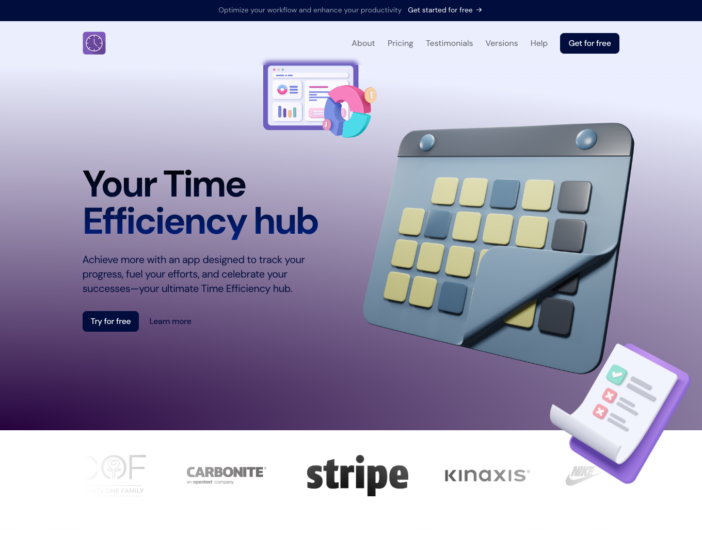
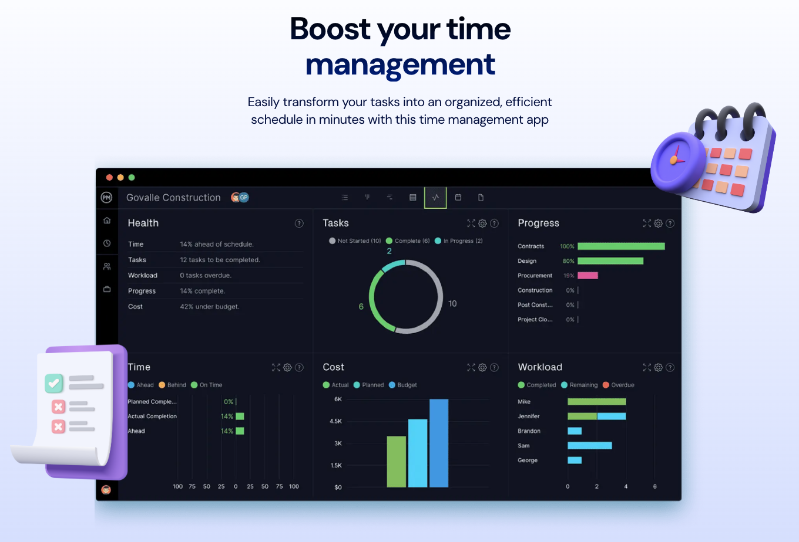
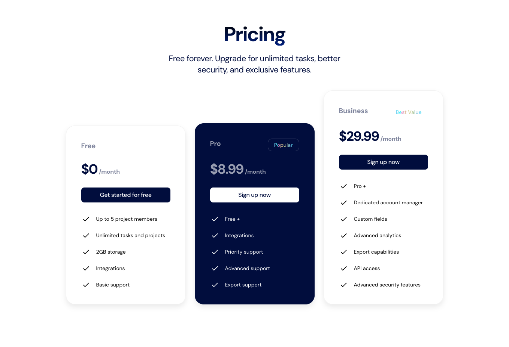

# Alvaro Ormeno Portafolio

<!-- TABLE OF CONTENTS -->

  
Table of Contents

-   [About The Project](#about-the-project)
-   [Demo](#demo)
-   [Built With](#built-with)
-   [Screenshots](#screenshots)

## About The Project

A simple but engaging SAAS Landing Page including hero, pricing, testimonials and call to action sections.

## Demo

-   Live Page: https://nextjs-landing-page-project.vercel.app/
-   Github Repo: https://github.com/alvaroormeno/nextjs-landing-page-project

## Built With

-   [HTML](https://developer.mozilla.org/en-US/docs/Web/HTML)
-   [CSS](https://developer.mozilla.org/en-US/docs/Web/CSS)
-   [JavaScript](https://developer.mozilla.org/en-US/docs/Web/JavaScript)
-   [React.js](https://reactjs.org/)
-   [Next.js](https://nextjs.org/)
-   [TailwindCSS](https://tailwindcss.com/)
-   [Framer Motion](https://www.framer.com/motion/introduction/)

## Screenshots

